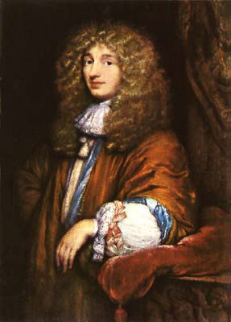
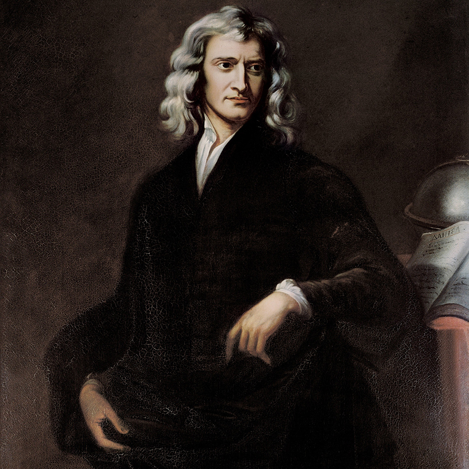
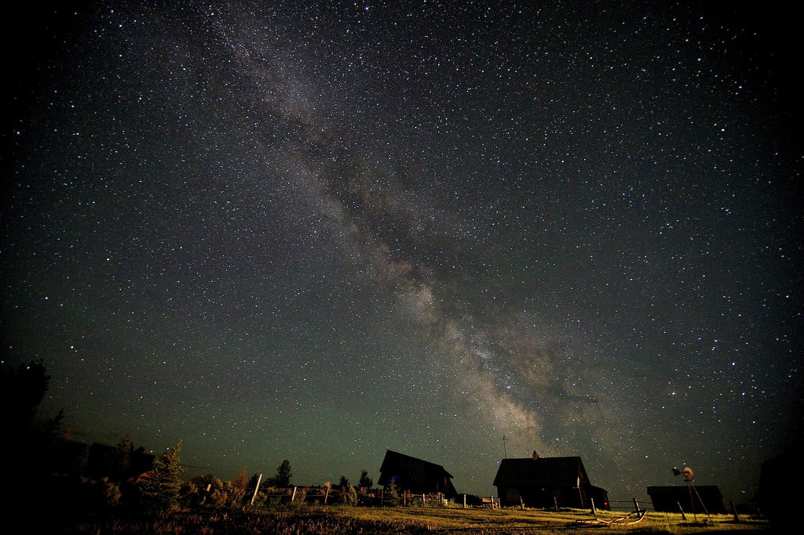
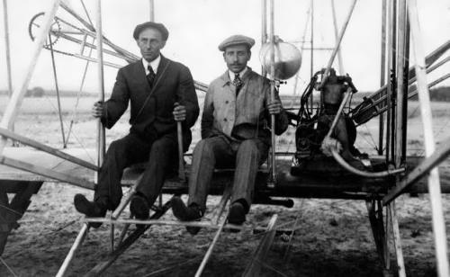
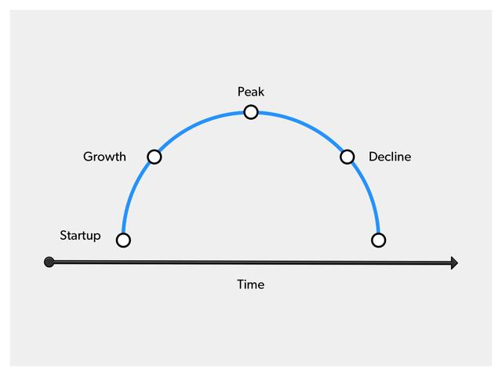
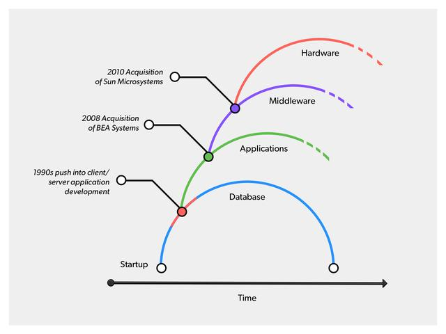
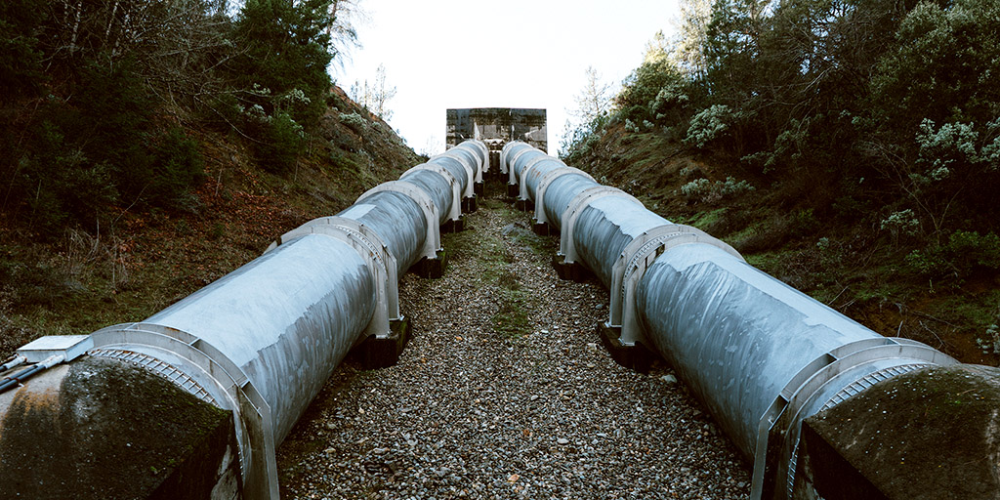
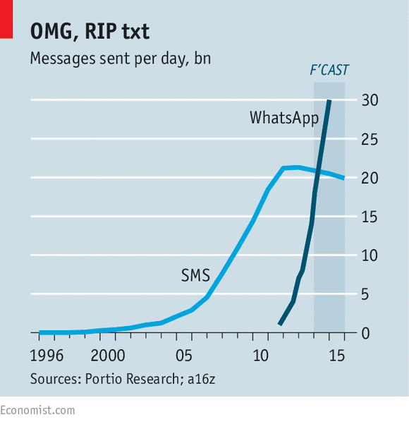

slidenumbers: true

# AWS Transformation Day 2017

### Recollection of the day

---

^
VP, Global Innovation Policy and Communications at Amazon.com
	
---

## Experimentation proves that something is wrong 
^
(never that something is right)
+ Einstein proves dutch and Newton wrong about light in a straight line
+ prior theories were proved incorrect

---

^
Until the early 1920s, most astronomers thought that the Milky Way contained all the stars!

---
## Innovation by experimentation


---
## Innovation must be able to fail

^
Willing to innovate, willing to fail
+ Let things fail so they can be falsified
+ are we scared to fail a sprint because we experimented?

---
## Innovation @ Amazon
### Assign two-pizza teams to work on innovation

---
## Decision making process
### They call it the 6-page narrative
### One hour meeting - 30 min. to read and 30 min. to make a decision

^
(forces to read the document)
+ when you write a sentence of prose, you have to decide what you need

---
# Three of their leadership principles
---
## Customer obsession

^
working backwards, write a press release to be released in the future and a FAQ
+ it acknowledges that it's impossible today
+ invent stuff that doesn't exist today
+ written in customer terms
Amazon Prime Air
+ Roughly **90-95% roadmap** is driver by what customers tell them matters;

---
## Are wright, A lot

^
Leaders seek diverse perspectives and work to **disconfirm** their beliefs
+ we think **long-term** (willing to be misunderstood)
+ build businesses that **outlast us**

---
## Deliver Results

^
commitment to operational excellence
+ decentralized teams

---

^
Worry about performance
+ loose focus
+ miss out on technologies
+ Test the water, wade in, go for a swim

---

^
Peter Hinssen

---

^
Cloud is the 12-horse motor (Wright brothers and flying)

---

---

---
## [fit] 70-20-10

^
You wish on Monday morning

---
## [fit] 93-7-0

^
On Friday afternoon...

---
## [fit] SOY

---

> In the next 5 years they will see more change that in the last 50
-- BMW

---

---

---