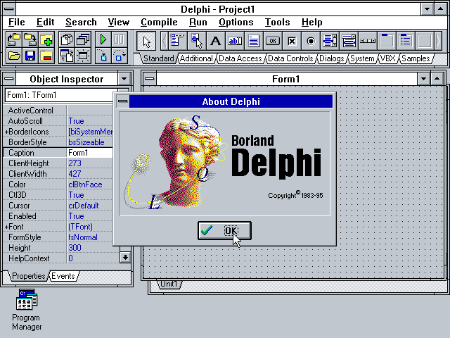

slidenumbers: true

# How to Stay Happy in a Corporate World[^1]
## Stuff They Don't Teach in Computer Science

[^1]: Nikola for Alessandro 

---

# My Journey

---

---

---

---

---

---

---

---
## 45 Hours a Week

---
## 25 Hours a Week

---

---

# Help People

---

## Take Care of Yourself
### Exercise
### Takes 12 minutes
### It only gets easier

---

---

---

## Empathy vs. Sympathy
### Video: https://www.youtube.com/watch?v=1Evwgu369Jw

---

## Most Respectful Interpretation
### What is the most generous assumption I can make?

---

# Convince People

---

---

