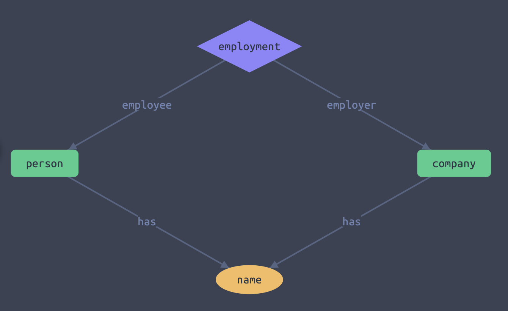
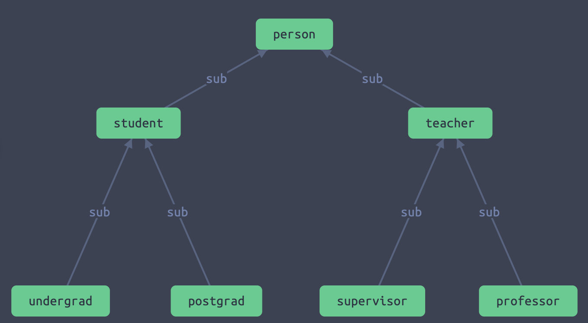
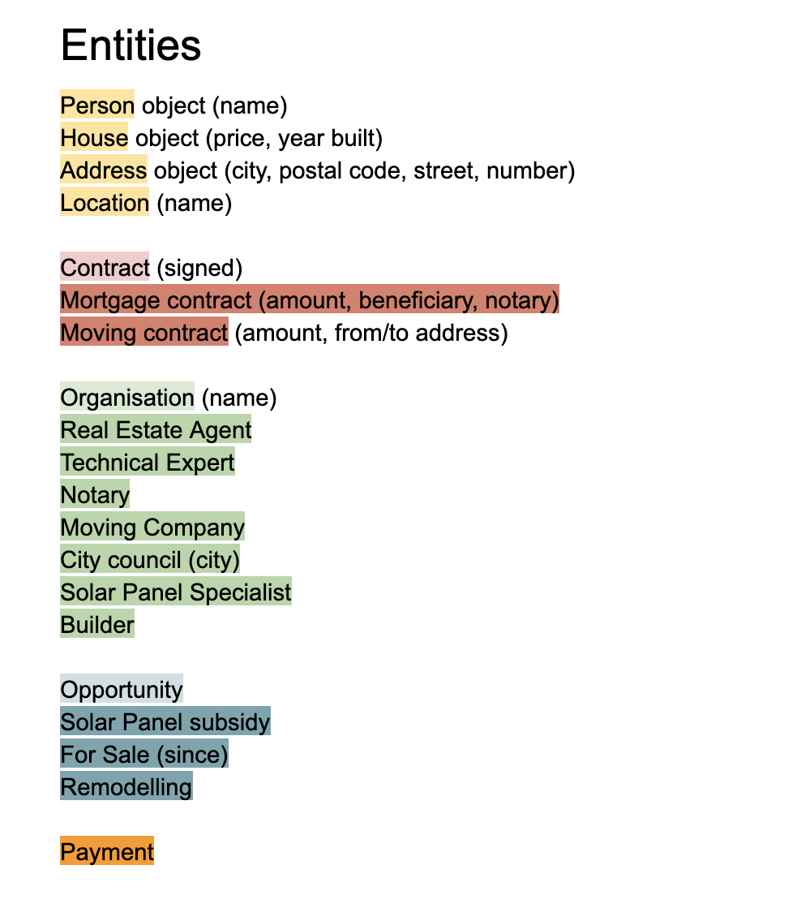
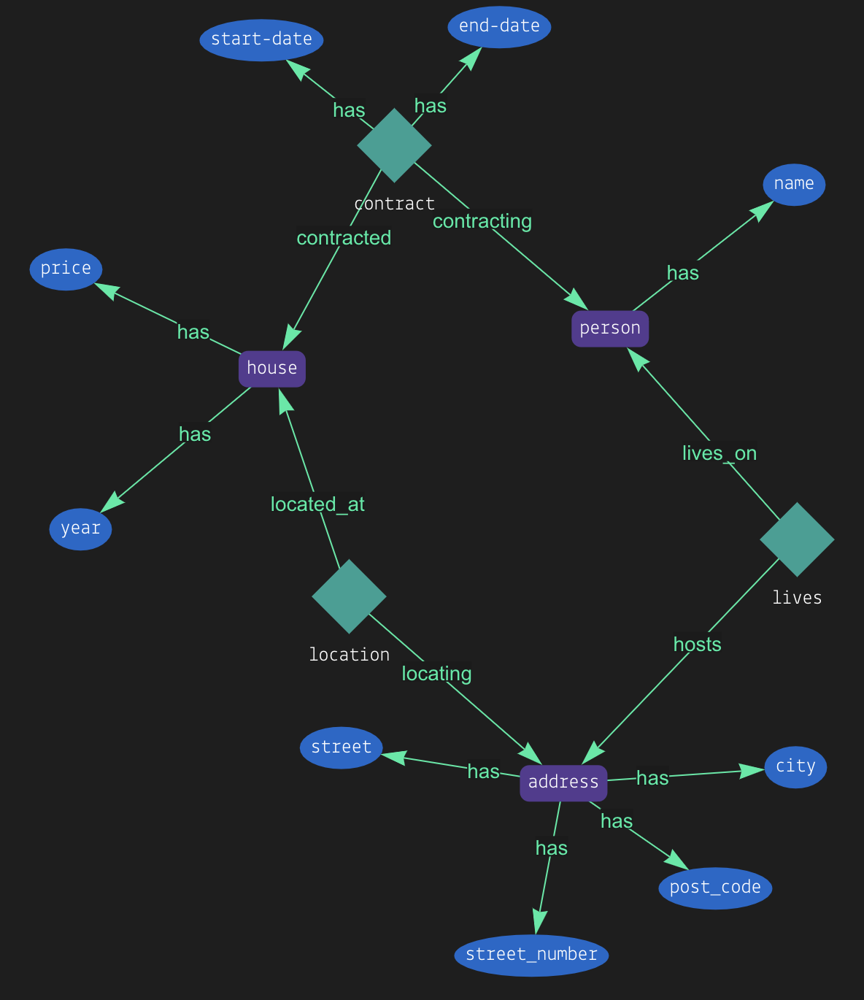

## Data Gravity

---



# Entities and Relationships

A **person** is an employee. A **company** is an employer.

They both have a *name* and a relationship between them: an **employment**.

---



# Types and Subtypes

Developers love this. :smile: :thumbsup:

---



# Entities in housing

Darker colors mean a sub-type.

---



# Peter owns a house

The address is Dianastraße 3 in München. It was built in 1965. It costs 351000 EUR.

---

```javascript
$a isa address,
  has city 'München',
  has street 'Dianastraße',
  has street_number 3,
  has post_code '80538';

$p isa person,
  has name 'Peter';

$h isa house,
  has price 351000,
  has year 1965;

(located_at: $h, locating: $a) isa location;
(contracted: $h, contracting: $p) isa contract;
```
