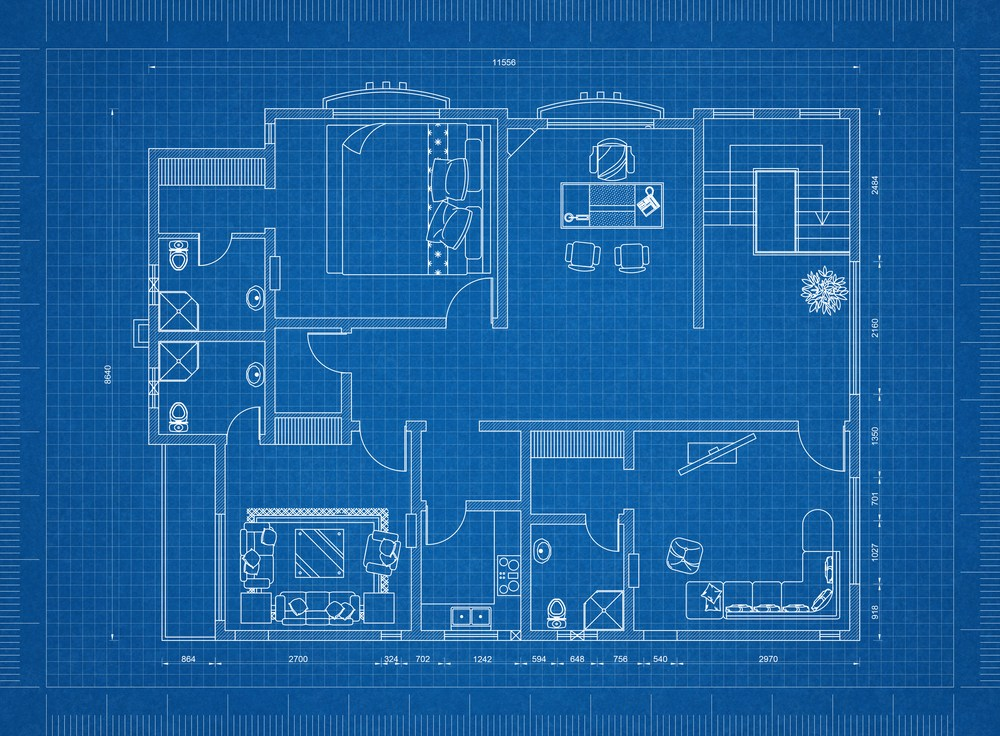

slidenumbers: true

## Software Flaws from Two Places:
- code doesn't match expectations, unit tests, types are used to catch those bugs
- code is correct, but expectations are wrong (specification errors)

---

## Specification Errors:
- Fundamental errors in our design
- Subtle bugs
- Regular tools simply can't find them

---

---

# We only work on the house, and skip the blueprint all together

---

# Invariant
Something we want to be true at every state of the system.
